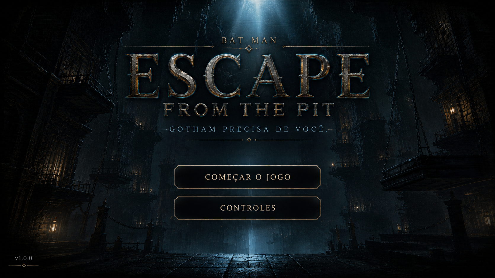

# Batman 2D: Escape from the Pit

Projeto final da disciplina **Projeto de Desenvolvimento de Jogos**, desenvolvido na Godot Engine.

## Sobre o jogo

Batman 2D é um jogo de plataforma no qual o jogador deve conduzir Batman por três fases, superar plataformas e inimigos e alcançar o topo antes que o tempo termine.

## Controles

| Ação | Teclas |
| --- | --- |
| Mover para a esquerda | `A` ou `←` |
| Mover para a direita | `D` ou `→` |
| Pular | `W`, `↑` ou `Espaço` |
| Pausar ou continuar | `Esc` |

## Como executar

1. Baixe este repositório ou extraia o arquivo ZIP do projeto.
2. Abra a Godot Engine 4.7 ou posterior.
3. Importe o arquivo `project.godot`.
4. Aguarde a importação dos recursos na primeira abertura.
5. Pressione `F5` para iniciar o jogo.

## Estrutura do projeto

- `world_01.tscn`, `world_02.tscn` e `world_03.tscn`: fases do jogo.
- `actors/`: personagem, inimigos, plataformas, menus e telas de transição.
- `scripts/`: movimentação do personagem, estado do jogo e transições.
- `assets/`: imagens, tiles, músicas e efeitos sonoros.
- `hud.gd`: vidas, cronômetro, progresso e stamina.

## Repositório

O código-fonte está disponível em:

[github.com/ARTHURESESE/EntregaFinal_Projeto_Desenvolvimento_Jogos](https://github.com/ARTHURESESE/EntregaFinal_Projeto_Desenvolvimento_Jogos)

## Créditos

Projeto acadêmico, sem fins comerciais. Batman e os elementos associados pertencem aos seus respectivos titulares.

Os créditos e as licenças dos recursos de terceiros incluídos no projeto estão disponíveis em:

- `assets/Batman RPG Maker Set 01/Credit List.txt`
- `assets/Cave Tileset/_LICENSE.txt`
